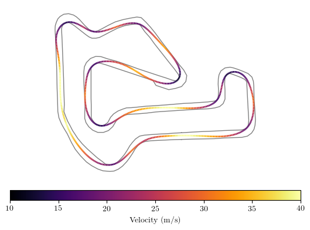

# Racing Line Optimisation for Autonomous Vehicles
  
  BSc Computer Science 2019-20, University of Bath.

  [Click here to view the submitted dissertation.](dissertation.pdf)

  

---

## Racing Line Generation

See data/{tracks,vehicles}/*.json for input format.

```
usage: main.py [-h]
               (--curvature | --compromise | --laptime | --sectors | --estimated)
               [--plot-corners] [--plot-path] [--plot-trajectory] [--plot-all]
               [--plot-format EXT]
               track vehicle

Racing line optimisation

positional arguments:
  track              path to JSON containing track data
  vehicle            path to JSON containing vehicle data

optional arguments:
  -h, --help         show this help message and exit
  --plot-corners     plot detected corners
  --plot-path        plot the generated path
  --plot-trajectory  plot the generated path with velocity gradient
  --plot-all         plot all relevant graphs
  --plot-format EXT  file format used to save plots

generation methods:
  --curvature        minimise curvature
  --compromise       minimise an optimal length-curvature compromise
  --laptime          directly minimise lap time
  --sectors          optimise and merge sector paths
  --estimated        minimise a pre-computed length-curvature compromise
```

For example, to optimise a racing line for Buckmore Park by minimising curvature:

```
cd python
python main.py --curvature --plot-all ../data/tracks/buckmore.json ../data/vehicles/tbr18.json
```
